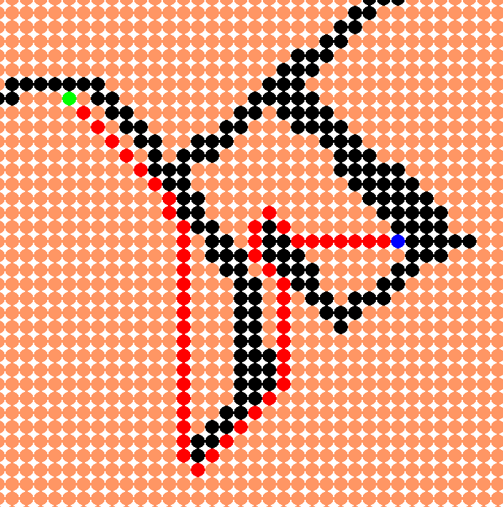

# A_Star
  A* is a graph traversal and path search algorithm, which is often used in computer science due to its completeness, optimality, and optimal efficiency.
  

## How to use:
```
git clone https://github.com/Taintedy/A_Star.git
cd A_Star
python3 main.py -r "Run"
```
- Draw obsticles with the left mouse button.
- Initialize start and end positions with the middle mouse button or with the space bar.

